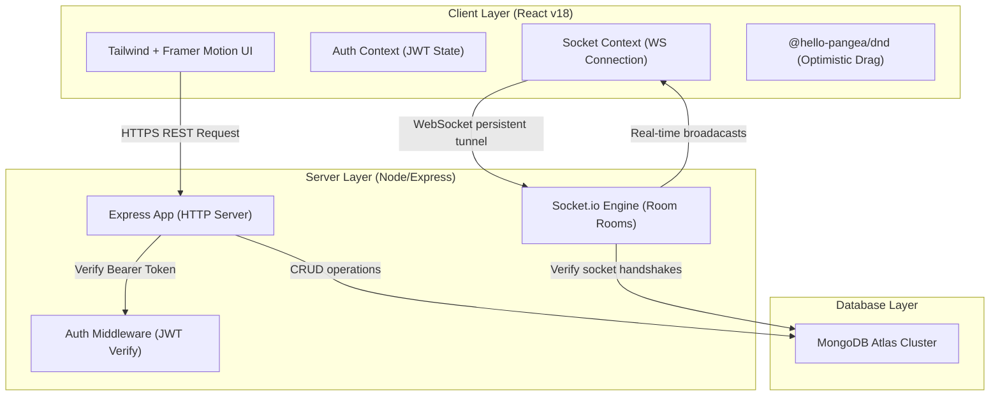

# 📋 CollabTool — Real-Time Kanban Board Platform

> A premium, full-stack real-time collaborative workspace built for the **CodeAlpha Internship**.  
> The system supports active multi-user WebSocket connections where modifications, card moves, column deletions, and checklists updates sync instantly across all connected sessions.

---

## 💎 Premium Design & Visual UX

- **SaaS Graphite Theme**: Move away from generic neon templates. Features custom ink-black charcoal base overlays, graphite border separators, and crisp cobalt elements.
- **Typographic Pairings**: Uses geometric headings (**Plus Jakarta Sans**), highly legible body text (**Inter**), and sharp data columns (**JetBrains Mono**).
- **Workspace sidebar & Toggles**: Side panel aggregates board metrics dynamically. Main board panels toggle between **Card Grids** and **Compact Table List rows**.
- **Context Preservation Drawers**: Replaces center popup dialogs with right-side **Slide-over Drawers** that keep the column board fully in context.
- **Interactive Markdown Checklists**: Parses list checkboxes (`- [ ]`, `- [x]`) from card notes dynamically. Clicking boxes compiles progress and updates progress rings instantly.
- **Circular Progress Rings**: Custom SVG radial progress dials compute checklist progression percentages.
- **Real-Time Activity Log Feed**: A collapsible board feed sidebar tracks recent socket actions (creations, drag updates, deletions) with user tags and visual action icons.

---

## 🛠️ Technology Stack

| Layer        | Technologies |
|--------------|--------------|
| **Frontend** | React 18 + Vite, Tailwind CSS, Framer Motion, `@hello-pangea/dnd`, Axios, React Router v6 |
| **Backend**  | Node.js, Express.js, Socket.io, JWT (`jsonwebtoken`), `bcryptjs` |
| **Database** | MongoDB Atlas / Mongoose |
| **Real-Time Engine** | WebSockets via Socket.io Rooms |

---

## 📂 System Architecture



---

## 🔌 WebSocket Events Protocol

### Client → Server Events
| Event Name    | Payload | Action |
|---------------|---------|--------|
| `join-board`  | `{ boardId, user }` | Authenticates socket session and joins Room ID |
| `leave-board` | `{ boardId }` | Detaches socket connection from Room ID |
| `move-card`   | `{ cardId, sourceListId, targetListId, sourceIndex, targetIndex, boardId }` | Dispatches database atomic writes and room updates |
| `add-card`    | `{ card, boardId }` | Broadcasts task card additions |
| `update-card` | `{ card, boardId }` | Broadcasts task note edits, tags, covers, and date modifications |
| `delete-card` | `{ cardId, listId, boardId }` | Broadcasts task removals |
| `add-list`    | `{ list, boardId }` | Broadcasts column additions |
| `delete-list` | `{ listId, boardId }` | Broadcasts column removals |
| `update-list` | `{ list, boardId }` | Broadcasts column title renames |
| `user-typing` | `{ boardId, userId, name, isTyping }` | Broadcasts active user typing status |

### Server → Client Broadcasts
| Event Name | Payload | Result |
|------------|---------|--------|
| `active-users-update` | `{ boardId, users[] }` | Refreshes avatar stack indicating live connectors |
| `card-moved-update` | `{ cardId, sourceListId, targetListId, ... }` | Re-renders columns sorting transitions via Framer Motion |
| `card-added` | `{ card, boardId }` | Appends task card item dynamically |
| `card-updated` | `{ card, boardId }` | Syncs descriptions, tags, cover accent stripes |
| `card-deleted` | `{ cardId, listId, boardId }` | Unmounts card item instantly |
| `list-added` | `{ list, boardId }` | Mounts new column panel |
| `list-deleted` | `{ listId, boardId }` | Unmounts column panel and cascade deletes cards |
| `list-updated` | `{ list, boardId }` | Updates column title dynamically |
| `user-typing-update` | `{ userId, name, isTyping }` | Displays/hides typing pencil overlay |

---

## 🚀 Installation & Local Setup

### Prerequisites
- **Node.js**: `v18.x` or higher
- **MongoDB**: Active local instance or MongoDB Atlas remote cluster connection URL

### 1. Database Configuration (Backend)
Navigate to the `/backend` directory:
```bash
cd backend
npm install
```
Create a `.env` file from the provided example template:
```bash
cp .env.example .env
```
Update `.env` with your credentials:
```env
PORT=5000
MONGO_URI=mongodb+srv://<username>:<password>@cluster.mongodb.net/collabtool
JWT_SECRET=your_super_secure_jwt_secret_token
CLIENT_URL=http://localhost:5173
```
Launch the development API node server:
```bash
npm run dev
```
*Backend initializes listening on:* **`http://localhost:5000`**

### 2. Client Application Setup (Frontend)
Navigate to the `/frontend` directory:
```bash
cd ../frontend
npm install
```
Launch the local dev Vite application:
```bash
npm run dev
```
*Frontend launches workspace on:* **`http://localhost:5173`**

---

## 📄 API Reference Table

### Authentication API
| Method | Endpoint | Payload | Headers | Action |
|--------|----------|---------|---------|--------|
| `POST` | `/api/auth/register` | `{ name, email, password }` | None | Registers user, hashes password |
| `POST` | `/api/auth/login` | `{ email, password }` | None | Returns JWT credentials payload |
| `GET` | `/api/auth/me` | None | `Bearer <token>` | Fetches user credentials |

### Workspace Boards API
| Method | Endpoint | Payload | Headers | Action |
|--------|----------|---------|---------|--------|
| `GET` | `/api/boards` | None | `Bearer <token>` | Fetches boards user owns or joins |
| `POST` | `/api/boards` | `{ title, description, coverColor }` | `Bearer <token>` | Generates board + 3 starter lists |
| `GET` | `/api/boards/:boardId` | None | `Bearer <token>` | Fetches full column/card tree |
| `PATCH` | `/api/boards/:boardId` | `{ title, description, coverColor }` | `Bearer <token>` | Modifies settings metadata |
| `DELETE` | `/api/boards/:boardId` | None | `Bearer <token>` | Removes board + cascade deletes lists/cards |
| `POST` | `/api/boards/:boardId/invite` | `{ email }` | `Bearer <token>` | Invites user by email lookup |
| `GET` | `/api/boards/:boardId/stats` | None | `Bearer <token>` | Compiles total/completed cards progress |

### Column Lists API
| Method | Endpoint | Payload | Headers | Action |
|--------|----------|---------|---------|--------|
| `POST` | `/api/lists` | `{ title, boardId }` | `Bearer <token>` | Appends column section |
| `PATCH` | `/api/lists/:listId` | `{ title }` | `Bearer <token>` | Renames column title |
| `DELETE` | `/api/lists/:listId` | None | `Bearer <token>` | Removes column + cascade deletes task cards |

### Task Cards API
| Method | Endpoint | Payload | Headers | Action |
|--------|----------|---------|---------|--------|
| `POST` | `/api/cards` | `{ title, listId, boardId }` | `Bearer <token>` | Creates task card |
| `PATCH` | `/api/cards/:cardId` | `{ title, description, labels[], dueDate, coverColor }` | `Bearer <token>` | Modifies specific card fields |
| `PATCH` | `/api/cards/:cardId/move` | `{ sourceListId, targetListId, sourceIndex, targetIndex }` | `Bearer <token>` | Atomic bulk database index relocation |
| `DELETE` | `/api/cards/:cardId` | None | `Bearer <token>` | Deletes task card item |

---

*Custom Crafted with ❤️ for CodeAlpha Internship by Aman Kanojiya*
